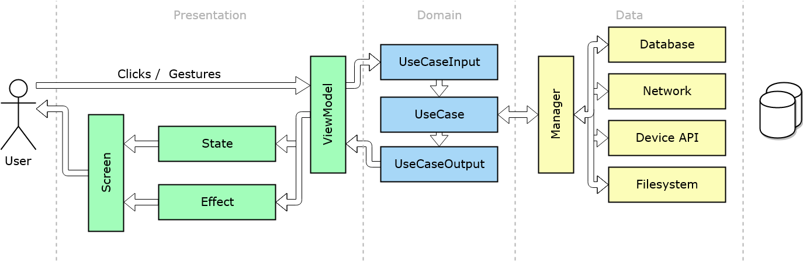

# Android MVVM library
 [](https://travis-ci.org/asuslennikov/mvvm) [](https://bintray.com/asuslennikov/maven/android-mvvm/_latestVersion)

It's small architectural library, inspired by Android ViewModel, React state and Clean Architecture. 
It has not too many code and you easily can gasp the main idea of this projects just within 15-30 min.

Reference:
- Android ViewModel: https://developer.android.com/topic/libraries/architecture/viewmodel
- React State: https://www.w3schools.com/react/react_state.asp
- Clean Architecture by Uncle Bob: https://blog.cleancoder.com/uncle-bob/2012/08/13/the-clean-architecture.html

## Usage
Artifacts are published in JCenter and Maven Central repository. Make sure that one of them is listed
in the `repository` section of `build.gradle` file in your root project folder:
```groovy
buildscript {
    repositories {
        jcenter()
    }
}
```
or
```groovy
buildscript {
    repositories {
        mavenCentral()
    }
}
```
##### A single module project
If you have just a single module, then in `build.gradle` file of this module add these dependencies:
```groovy
dependencies {
    implementation "com.github.asuslennikov:mvvm-domain:x.y.z"
    implementation "com.github.asuslennikov:mvvm-presentation:x.y.z"
}
```
Please replace the 'x.y.z' by the latest available version (check the JCenter badge at the top of file).

##### A multi-module project
if you follow the clean architecture guideline and have separate modules 
for your business rules (a `domain` module) and presentation (a `presentation` module), then:
- in your `domain` module add this dependency in `build.gradle` file:
    ```groovy
    dependencies {
        api "com.github.asuslennikov:mvvm-domain:x.y.z"
    }
    ```
- and in `presentation` module:
    ```groovy
    dependencies {
        implementation "com.github.asuslennikov:mvvm-presentation:x.y.z"
    }
    ```
Please replace the 'x.y.z' by the latest available version (check the JCenter badge at the top of file).

## Library components

### Communication diagram

Data flow diagram:



### UML overview

On this image you can see an overview of main library components:


### Components details

Presentation layer:
- Screen

| Name            | Screen |
| :---            | :--- |
| Synonyms        | View, Render |
| Component layer | Presentation |
| Responsibility  | It fully controls how user will see and interact with piece of application. In fact it renders a given state and applies effects to UI |
| UML diagram     |  |
| Notes           | - It never changes state by itself, always delegates it to view model <br /> - It doesn't have any behaviour-related logic. All this staff goes to view model. <br /> - Screen should have reference to only one view model. <br /> - Screen  doesn't need any external dependencies, except the view model (because it is the only one source of truth for the screen). <br />  - It is recommended to have espresso tests for the screen. Unit tests are not mandatory (because screen should have only UI logic and it's not easy to check correctness with regular unit tests). |
| Example link    | TBD |

- State

| Name            | State |
| :---            | :--- |
| Synonyms        | |
| Component layer | |
| Responsibility  | |
| UML diagram     |  |
| Notes           | |
| Example link    | TBD |

- Effect

| Name            | Effect |
| :---            | :--- |
| Synonyms        | |
| Component layer | |
| Responsibility  | |
| UML diagram     |  |
| Notes           | |
| Example link    | TBD |

- ViewModel

| Name            | ViewModel |
| :---            | :--- |
| Synonyms        | |
| Component layer | |
| Responsibility  | |
| UML diagram     |  |
| Notes           | |
| Example link    | TBD |

Domain layer:
- UseCaseInput

| Name            | UseCaseInput |
| :---            | :--- |
| Synonyms        | |
| Component layer | |
| Responsibility  | |
| UML diagram     |  |
| Notes           | |
| Example link    | TBD |

- UseCaseOutput

| Name            | UseCaseOutput |
| :---            | :--- |
| Synonyms        | |
| Component layer | |
| Responsibility  | |
| UML diagram     |  |
| Notes           | |
| Example link    | TBD |

- UseCase

| Name            | UseCase |
| :---            | :--- |
| Synonyms        | |
| Component layer | |
| Responsibility  | |
| UML diagram     |  |
| Notes           | |
| Example link    | TBD |

Data layer:
- Manager

| Name            | Manager |
| :---            | :--- |
| Synonyms        | |
| Component layer | |
| Responsibility  |  |
| UML diagram     | Np specific component diagram |
| Notes           | |
| Example link    | TBD |
