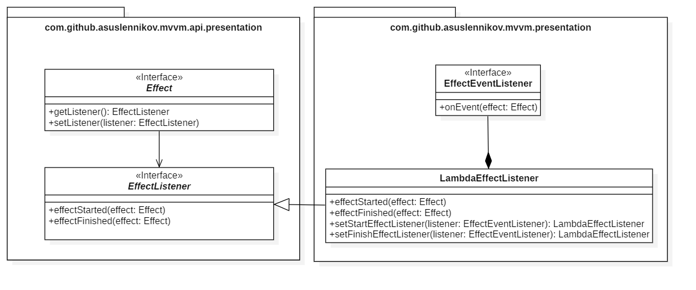

# Android MVVM library
 [](https://travis-ci.org/asuslennikov/mvvm) [](https://bintray.com/asuslennikov/maven/android-mvvm/_latestVersion)

It's small architectural library, inspired by Android ViewModel, React state and Clean Architecture. 
It has not too many code and you easily can gasp the main idea of this projects just within 15-30 min.

Reference:
- Android ViewModel: https://developer.android.com/topic/libraries/architecture/viewmodel
- React State: https://www.w3schools.com/react/react_state.asp
- Clean Architecture by Uncle Bob: https://blog.cleancoder.com/uncle-bob/2012/08/13/the-clean-architecture.html

## Usage
Artifacts are published in JCenter and Maven Central repository. Make sure that one of them is listed
in the `repository` section of `build.gradle` file in your root project folder:
```groovy
buildscript {
    repositories {
        jcenter()
    }
}
```
or
```groovy
buildscript {
    repositories {
        mavenCentral()
    }
}
```
##### A single module project
If you have just a single module, then in `build.gradle` file of this module add these dependencies:
```groovy
dependencies {
    implementation "com.github.asuslennikov:mvvm-domain:x.y.z"
    implementation "com.github.asuslennikov:mvvm-presentation:x.y.z"
}
```
Please replace the 'x.y.z' by the latest available version (check the JCenter badge at the top of file).

##### A multi-module project
if you follow the clean architecture guideline and have separate modules 
for your business rules (a `domain` module) and presentation (a `presentation` module), then:
- in your `domain` module add this dependency in `build.gradle` file:
    ```groovy
    dependencies {
        api "com.github.asuslennikov:mvvm-domain:x.y.z"
    }
    ```
- and in `presentation` module:
    ```groovy
    dependencies {
        implementation "com.github.asuslennikov:mvvm-presentation:x.y.z"
    }
    ```
Please replace the 'x.y.z' by the latest available version (check the JCenter badge at the top of file).

## Library components

### Data flow diagram

 diagram")

### UML overview

On this image you can see an overview of main library components:


### Components details

**Presentation layer:**
<details open>
    <summary>Screen</summary>

| Name            | Screen |
| :---            | :--- |
| Synonyms        | View, Render |
| Component layer | Presentation |
| Responsibility  | It renders a part of application UI (it controls what user see and how he can communicate with that part of UI). |
| UML diagram     |  |
| Notes           | - It never changes `State` by itself, always delegates it to `ViewModel`. <br /> - It doesn't have any behaviour-related logic. All this staff goes to `ViewModel`. <br /> - It shouldn't have mutable local fields which have influence to UI (except, maybe, a saved `State`). <br /> - `Screen` should have reference to only one `ViewModel`. <br /> - `Screen`  doesn't need any external dependencies, except the `ViewModel` (because it is the only one source of truth for the `Screen`). <br />  - As a name for concrete class, you can use a general meaning plus the `Screen` suffix (for example `LastNewsScreen`). Layout file should have only general meaning as a name, without any suffix (don't use `_fragment`, `_activity` or `_screen`: `last_news.xml`) <br /> - It is recommended to have Espresso tests for `Screen`. Unit tests are not necessary (because `Screen` have only UI logic and it's not easy to check correctness with regular unit tests). |
| Example link    | TBD |
 
</details>

<details>
    <summary>State</summary>

| Name            | State |
| :---            | :--- |
| Synonyms        | ViewState, ScreenState, UIModel, Model |
| Component layer | Presentation |
| Responsibility  | It describes a state (collection of elements' properties) at specific moment in time for part of UI |
| UML diagram     |  |
| Notes           | - It's a POJO class (data class in Kotlin). <br/> - It doesn't have any logic, only getters and setters. <br /> - Successor of this interface should never implement the `UseCaseInput` or `UseCaseOutput` in the same time. <br /> - As a name for implementation, it's recommended to use a name of specific screen and replace the `Screen` word by `State` (for example `LastNewsState`). <br /> - Should implement some mechanism for serialization / deseralization. For example, use the `@Parcel` annotation or set JSON annotations of your favorite mapper. <br /> - Fields have descriptive names, but not "action" names (use `newsListLoaderVisible` instead of `showNewsListLoader`). <br /> - No need in Unit tests. |
| Example link    | TBD |
 
</details>

<details>
    <summary>Effect</summary>

| Name            | Effect |
| :---            | :--- |
| Synonyms        | UIAction, Action |
| Component layer | Presentation |
| Responsibility  | It represents some UI action, which should be executed only once (for example, open keyboard or launch shake animation for element). |
| UML diagram     |  |
| Notes           | - It's useful for one-shot events, which can be skipped if user is not interacting with UI at given time (if application is in background) |
| Example link    | TBD |
 
</details>

<details>
    <summary>ViewModel</summary>

| Name            | ViewModel |
| :---            | :--- |
| Synonyms        | Handler, Behaviour, Controller |
| Component layer | Presentation |
| Responsibility  | It defines what to render on screen and how to process user input. |
| UML diagram     |  |
| Notes           | - Methods should have names which represent a happened interaction, but not the expected result (use `showMoreClicked()`, but not the `loadNextPage()`). <br /> - It can contain other `ViewModel`s. <br /> - You should remember, that when activity dies, the model dies as well. So keep in mind, that you should be able to restore inner `ViewModel`'s fields based on given `State` object. <br /> - All dependencies should be declared in constructor (don't use `SomeClass.getInstance()`, it makes component untestable). <br /> - Component should have Unit tests. |
| Example link    | TBD |
 
</details>

**Domain layer:**
<details>
    <summary>UseCaseInput</summary>

| Name            | UseCaseInput |
| :---            | :--- |
| Synonyms        | CommandArgument, Parameter |
| Component layer | Domain |
| Responsibility  | It holds input information for `UseCase` |
| UML diagram     |  |
| Notes           | - It's a POJO class (data class in Kotlin). <br /> - It should be immutable. <br/> - It doesn't have any logic, only getters. <br /> - Successors of this interface shouldn't implement the `State` or `UseCaseOutput` interface at the same time. |
| Example link    | TBD |
 
</details>

<details>
    <summary>UseCaseOutput</summary>

| Name            | UseCaseOutput |
| :---            | :--- |
| Synonyms        | CommandResult |
| Component layer | Domain |
| Responsibility  | It holds `UseCase` result |
| UML diagram     |  |
| Notes           | - It's a POJO class (data class in Kotlin). <br /> - It should be immutable. <br/> - It doesn't have any logic, only getters. <br /> - Successors of this interface shouldn't implement the `State` or `UseCaseInput` interface at the same time. |
| Example link    | TBD |
 
</details>

<details>
    <summary>UseCase</summary>

| Name            | UseCase |
| :---            | :--- |
| Synonyms        | BusinessScenario, Scenario, Interactor, Command |
| Component layer | Domain |
| Responsibility  | It contains application's business logic |
| UML diagram     |  |
| Notes           | - It has structure which is similar to algorithms: it has input data, result of work (output data) and rules by which it converts input to output. <br /> - Implementation can reference to another `UseCase`s. <br /> - It communicates with data layer using interfaces (should be defined in domain layer) and takes concrete implementations as arguments in constructor. <br /> - It has no connection with `State` in any way. <br /> - It should have regular unit tests (since it has no platform specific logic). |
| Example link    | TBD |
 
</details>

**Data layer:**
<details>
    <summary>Manager</summary>

| Name            | Manager |
| :---            | :--- |
| Synonyms        | Gateway, Repository |
| Component layer | Data |
| Responsibility  | It provides a platform specific implementation for interfaces, defined in domain layer |
| UML diagram     | No specific component diagram |
| Notes           | - It doesn't know anything about presentation layer. It depends only on domain layer. <br /> - It uses platform-specific tests (for example, you can use Robolectric). |
| Example link    | TBD |
 
</details>